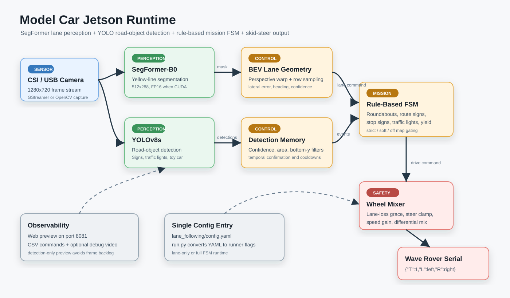
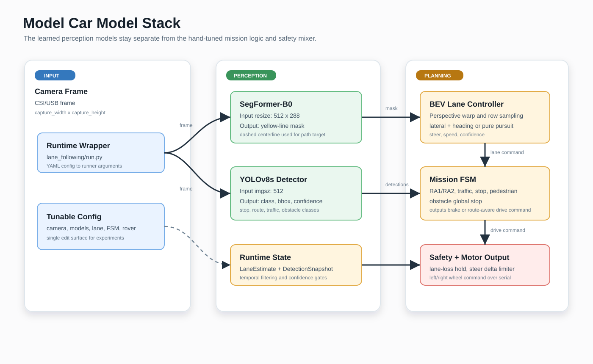
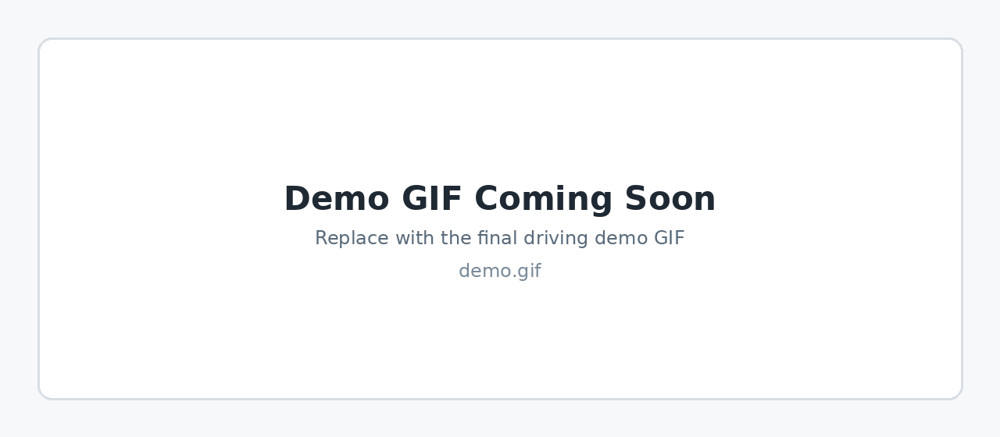
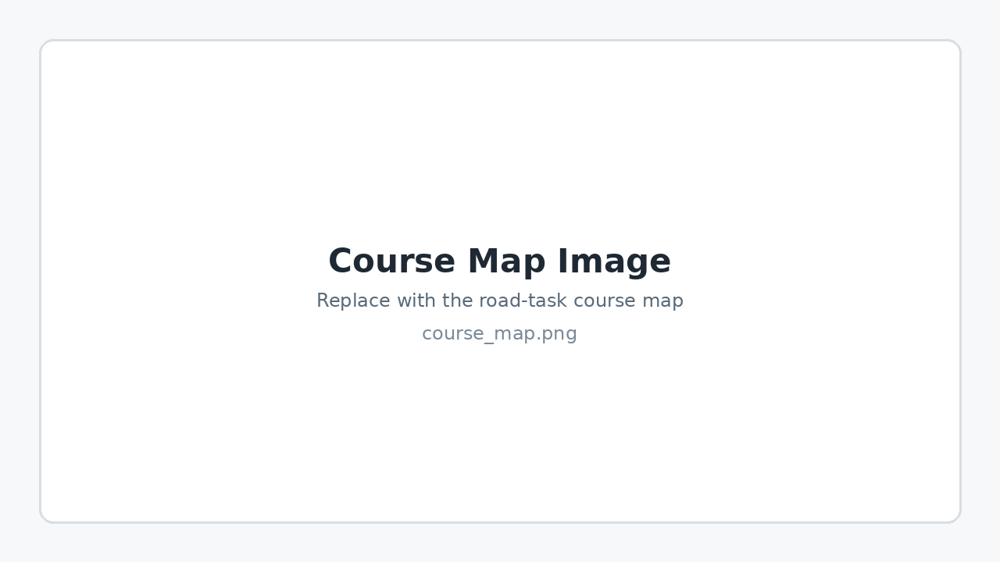
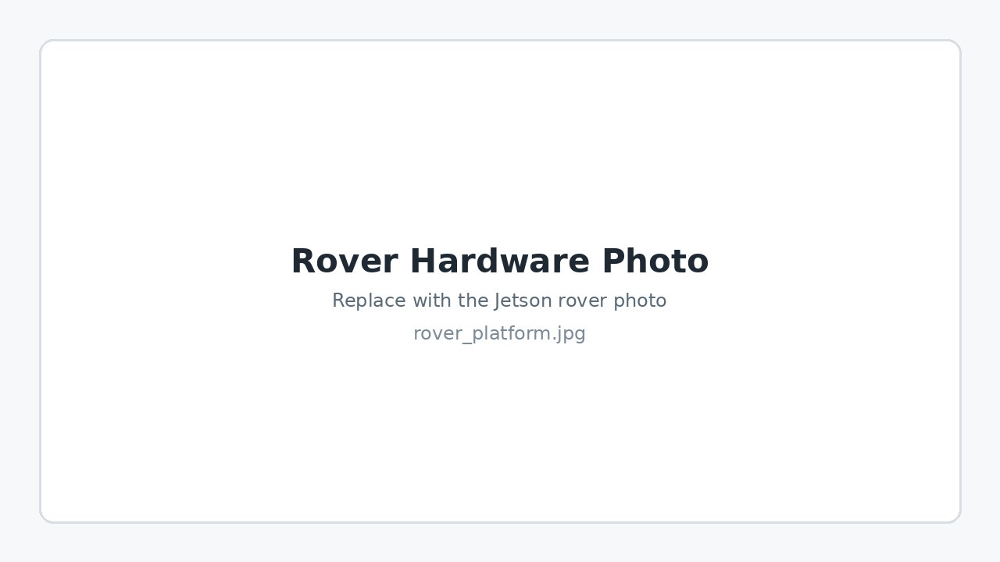
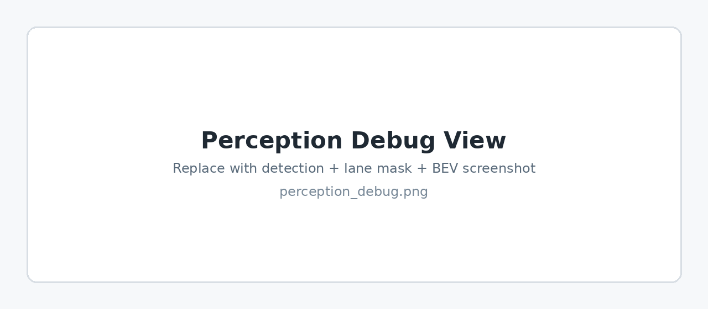

# Model Car Road-Task FSM on Jetson
> **Real-world autonomous driving system for a Jetson-based model car using lane segmentation, YOLO object detection, and rule-based mission control.**

### 1. Project Overview
This repository contains a Jetson Orin Nano deployment package for a small skid-steer rover.  
The goal is to complete a road-task course with lane following, traffic-sign recognition, traffic-light reaction, roundabout route selection, and obstacle-stop behavior.

* **Role:** Perception, rule-based decision logic, and hardware runtime integration
* **Platform:** Jetson Orin Nano, Wave Rover skid-steer chassis, CSI camera
* **Models:** SegFormer-B0 lane segmentation, YOLOv8s road-object detection
* **Key Features:**
    * Yellow-lane segmentation and BEV lane geometry estimation
    * Detection of stop signs, route signs, traffic lights, pedestrian signs, and toy-car obstacles
    * Rule-based finite state machine for mission-stage control
    * Lane-loss recovery, steering jump limiting, and serial motor command output

---

### 2. System Architecture
The runtime separates perception, mission logic, and motor safety handling.  
The lane model produces a BEV lane estimate, while the object detector provides event inputs to the mission FSM.



> **Figure 1.** Jetson runtime pipeline: camera input, lane segmentation, object detection, FSM decision logic, safety mixer, and Wave Rover serial output.

---

### 3. Perception & Control Pipeline
The learned perception modules are kept separate from the hand-tuned mission controller.  
This made it easier to tune the system on the real course while keeping the behavior interpretable.



> **Figure 2.** Model and control stack used for lane-following and road-task decision making.

#### Main Pipeline
1.  Capture camera frame from CSI/USB camera.
2.  Run SegFormer-B0 to segment the yellow lane.
3.  Warp the lane mask to BEV and estimate lateral/heading error.
4.  Run YOLOv8s detection for road-task objects.
5.  Update the rule-based FSM according to current mission stage.
6.  Convert drive command to left/right skid-steer wheel commands.

---

### 4. Course, Hardware & Demo Media
The following media slots are prepared for the course map, rover hardware, perception output, and final driving demo.



> **Demo Slot.** Replace this placeholder by adding `docs/assets/demo.gif`.

Recommended media filenames:

| File | Description |
| :--- | :--- |
| `docs/assets/course_map.png` | Road-task course map |
| `docs/assets/rover_platform.jpg` | Jetson rover hardware photo |
| `docs/assets/perception_debug.png` | Detection + lane mask + BEV debug view |
| `docs/assets/demo.gif` | Final driving demo GIF |

#### Course Map
Add the task course image as:

```text
docs/assets/course_map.png
```



#### Rover Hardware
Add the Jetson rover photo as:

```text
docs/assets/rover_platform.jpg
```



#### Perception Debug View
Add the detection + lane mask + BEV screenshot as:

```text
docs/assets/perception_debug.png
```



---

### 5. Getting Started
Install the Jetson-compatible PyTorch wheel for your JetPack version first.  
Then install the remaining dependencies:

```bash
cd model_car_jetson
python3 -m pip install -r requirements_jetson.txt
```

Place model weights as described in:

```text
model_car_jetson/weights/README.md
```

Run a dry-run first:

```bash
cd model_car_jetson
./lane_following/run.sh --dry-run
```

Run the full runtime:

```bash
./lane_following/run.sh
```

For motor output, confirm the serial device and arm deliberately:

```bash
./scripts/find_rover_serial.sh
./lane_following/run.sh --arm
```

---

### 6. Main Configuration
The main tuning file is:

```text
model_car_jetson/lane_following/config.yaml
```

Important sections:

* `camera`: CSI/USB input settings
* `models`: SegFormer and YOLO inference settings
* `lane`: lane controller gains and BEV behavior
* `fsm`: mission-stage switches, detection filters, and timing
* `rover`: wheel mixing and serial output
* `fault_tolerance`: lane-loss grace and steering safety limits

---

### 📂 Repository Structure
```text
.
├── README.md
├── docs/
│   ├── assets/                 # Demo GIF and hardware/media images
│   └── images/                 # Architecture diagrams
├── model_car_jetson/
│   ├── lane_following/         # Clean runtime entry point
│   ├── scripts/                # Jetson runners and perception/control modules
│   ├── configs/                # Legacy JSON configs and class metadata
│   ├── metadata/               # Training metadata and class summaries
│   └── weights/                # Weight download instructions
└── rule_based/
    └── scripts/
        └── rule_based_driving.py
```

---

### 7. Model Weights
Weights are excluded from Git and should be attached to GitHub Releases or stored with Git LFS.

Expected assets:

```text
model_car_jetson/weights/
├── detection/
│   └── yolov8s_model_car_best.pt
└── segmentation/
    └── segformer_b0_yellow_line_best_model/
        ├── config.json
        └── model.safetensors
```

The backup detector checkpoint is not required for the public repository.
